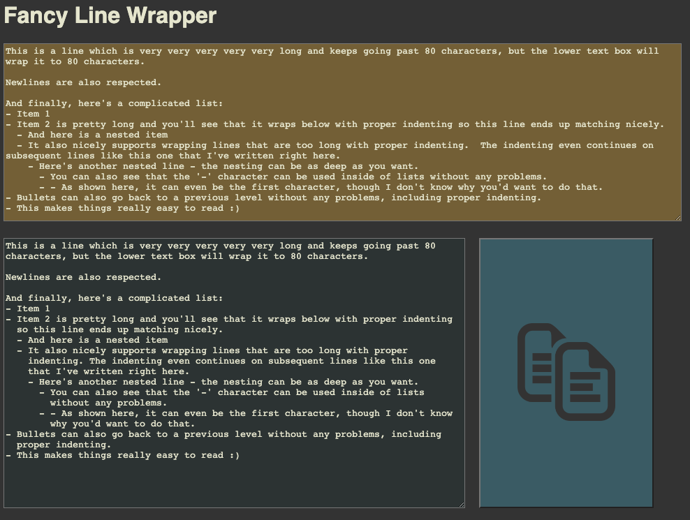

# Fancy Line Wrapper
A simple webpage that helps me format git commit messages the way I like and to match external requirements.

1. [Overview](#overview)
1. [Useful Tips](#useful-tips-)

[Go to Fancy Line Wrapper here](FancyLineWrapper.html)

### Overview
Enter text into the upper text box however you want, and the lower text box will automatically re-format it on-the-fly
according to the following rules:
1. Line wraps at 80 characters (using newline characters).
1. Lines beginning with a `-` are properly indented as a bulleted list, including wrapping the line with deeper
indenting so it matches nicely.
1. Bulleted lists also support nesting, including wrapping; just use spaces to indent the `-`.

Here's an example to better illustrate things:

### Useful Tips:
- The resulting text can either be copy-pasted from the lower text box the usual way, or by clicking the giant copy
button.
- The upper text box can be resized freely, while the lower text box can only be resized down.
- Refreshing, or even closing the page will not lose your entered text.
- If your browser/OS has spell-checking, it should work.
